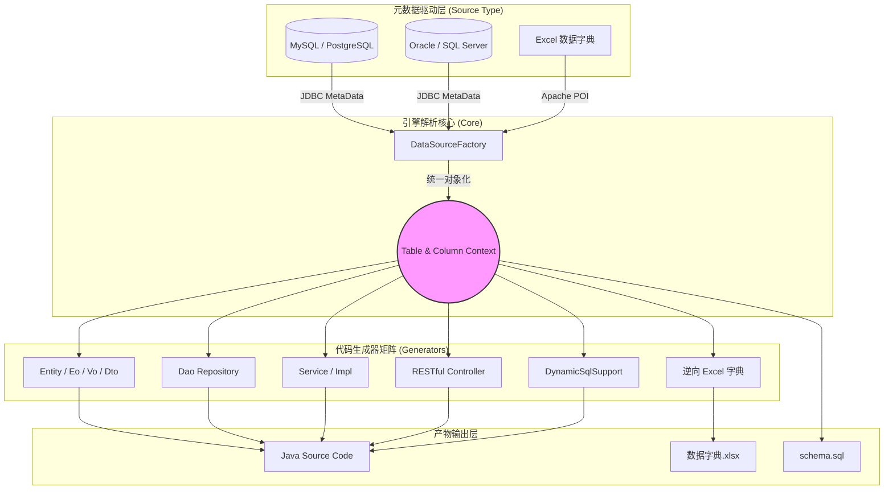
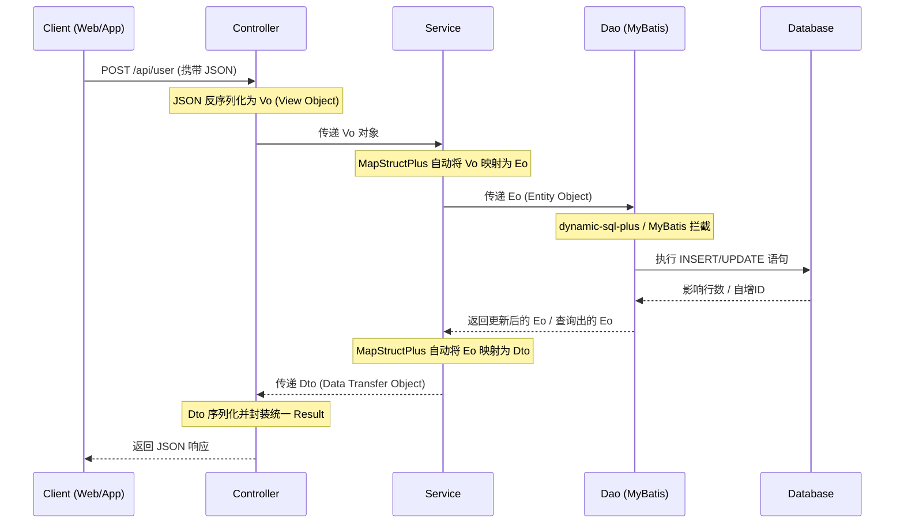

# Kunter Generator 核心架构与设计白皮书

本指南旨在详细解析 `kunter-generator` 的核心代码生成架构、运行时对象流转链路，以及现代化的编码规范。我们的愿景是通过**高度规范化**和**双向驱动**的手段，大幅度降低企业级持久层开发的心智负担，将其从单纯的代码生成工具，全面升级为**企业级中后台标准脚手架生成器**。

## 1. 生成器引擎全景图 (Generator Engine Architecture)

无论是通过 Excel 还是数据库，所有的元数据都会被提炼为统一的 `Table` / `Column` 内核数据结构，最后分发给对应的 Java 生成器矩阵，实现无缝生成。基于 MyBatis Generator (MBG) 原生的 Java DOM 体系（如 `FullyQualifiedJavaType`）构建，确保生成的代码具有原生级别的高可靠性与排版质量。



## 2. 运行时实体流转 (Eo-Vo-Dto Mapping)

现代后端架构强调职责分离。在数据流转层面，我们引入了极其强烈的类型分层，并结合 `MapStructPlus` 与 `Lombok` 实现了自动且安全的字段映射：

- **Eo (Entity Object)**：持久层实体对象，与数据库表结构一一对应，仅在 Service 层与 Dao (Mapper) 层之间流转。
- **Vo (View Object)**：前端请求入参对象，代表前端向后端发送的数据。
- **Dto (Data Transfer Object)**：后端响应出参对象，代表后端向前端返回的视图数据，内部将隐藏密码等敏感信息。



### 2.1 基础模型继承规范 (Base Models)

所有模型对象默认继承对应的基类（可通过配置进行可选生成，或关联已存在的基类）：
- `Eo` extends `BaseEo`
- `Vo` extends `BaseVo`
- `Dto` extends `BaseDto`

**约束红线**：
1. 所有基类及子类均需实现 `java.io.Serializable` 接口。
2. **绝对杜绝**手动生成或定义 `serialVersionUID`。

## 3. 技术栈大融合设计

### 3.1 全面拥抱 Lombok
生成的模型对象全面告别传统的 getter/setter 和 `BeanUtils`：
- 统一使用 `@Data`、`@NoArgsConstructor`、`@AllArgsConstructor` 注解。
- 采用 `@SuperBuilder` 替代传统的 `@Builder`，以完美支持 `Base` 体系父类属性的一键构建。
- 在子类中统一追加 `@EqualsAndHashCode(callSuper = true)`。

### 3.2 零反射的高性能对象转换 (MapStructPlus)
引入 `MapStructPlus` 彻底消灭 `Service` 层的繁琐属性复制：
- 在生成的 `Vo` 和 `Dto` 类头部自动打上 `@AutoMapper(target = XxxEo.class)` 注解。
- 在 `ServiceImpl` 中通过注入 `io.github.linpeilie.Converter`，天然实现 `Vo -> Eo` 和 `Eo -> Dto` 的极速转换。

### 3.3 强类型安全查询 (MyBatis Dynamic SQL)
彻底摒弃 XML 文件与脆弱的 `<if>` 标签拼接：
- 业务层查询将采用原生的 Lambda 链式调用封装，杜绝任何 SQL 注入可能并获得极致的编译期检查。

## 4. Dynamic-SQL-Plus 协同架构

当 `dynamic.plus.enable=true` 时，`kunter-generator` 会改变其生成策略，从原有的冗长 Support 模式退化为极其简洁的运行时反射模式。

```mermaid
graph LR
    subgraph Traditional["原生 MyBatis Dynamic SQL (冗长)"]
        T1[UserEo]
        T2[UserDynamicSqlSupport (常量字典)]
        T3[UserMapper (方法堆砌)]
    end

    subgraph DynamicPlus["Dynamic-SQL-Plus (无痕)"]
        P1["@DynamicMapper<br/>@TableId<br/>UserEo"]
        P2["UserDao extends BaseRepository"]
    end

    Traditional -.->|代码量大、每次修改表都要全量覆盖| DynamicPlus
```

## 5. 文档注释与编码规范
- 类和方法必须具有标准的 JavaDoc 注释，且格式紧凑，如 `@author` 和类描述之间**无空行**。
- 表字段的注释强制采用单行文档注释格式：`/** 注释内容 */`。
